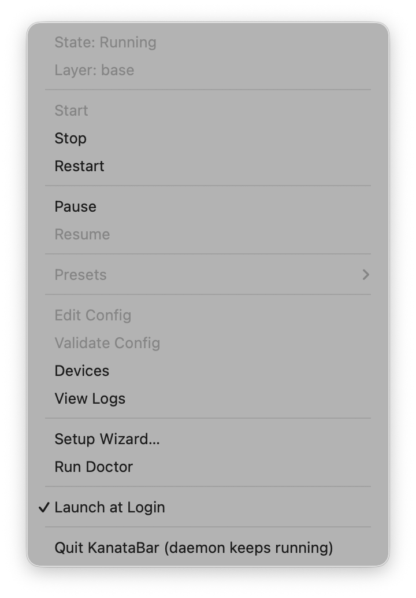

<div align="center">
  
  <h1>KanataBar</h1>
  <p><strong>A macOS supervisor and menu-bar app for <a href="https://github.com/jtroo/kanata">kanata</a>.</strong></p>
  <p>
    <a href="https://github.com/ibimal/kanatabar/actions/workflows/ci.yml"></a>
    <a href="LICENSE"></a>
  </p>
</div>

kanata is a fantastic keyboard remapper, but on macOS it isn't a first-class citizen:

- **Hotplug is invisible.** kanata matches input devices once at startup and never re-scans — plug in a keyboard and it simply isn't remapped until kanata restarts.
- **Nothing keeps it alive.** No boot service, no crash recovery; when kanata dies your remaps silently vanish.
- **Its dependencies aren't kept alive either.** kanata needs the Karabiner-DriverKit virtual-HID *daemon* running, but the driver package registers no service for it — someone has to manage that process.

KanataBar closes those gaps and makes kanata behave like a proper macOS service:

- 🔌 **Hotplug re-sync** — an IOKit device watcher restarts kanata (debounced) when keyboards come and go, so a freshly plugged keyboard is remapped within moments.
- 🚀 **Starts at boot, survives crashes** — a root LaunchDaemon supervises kanata with bounded exponential backoff, health checks, and sleep/wake re-sync; launchd revives the supervisor itself.
- 🩺 **Actionable failure states** — driver missing, Input Monitoring denied, device grab conflicts, VHID daemon down: each becomes a distinct *Degraded* state with a fix hint, a notification, and a `doctor` check — not a silent crash loop.
- ⌨️ **VHID daemon management** — installs a LaunchDaemon for the Karabiner virtual-HID daemon when nothing else (e.g. Karabiner-Elements) manages it, and leaves it alone when something does.
- 🖥️ **Menu-bar app** — live state and active layer, start/stop/pause/resume, preset switching, notifications, first-run wizard.
- 🧰 **Full-parity CLI** — everything the tray does, scriptable: `kanatactl status --json`, `watch`, `logs -f`, `preset switch`, `doctor`.
- 📋 **Config presets with safe apply** — every `.kbd` is validated (`kanata --check`) before it's applied, with last-known-good rollback; a broken config never takes down a working setup.

## Status

Early but real — actively developed, and issue reports are very welcome
([`kanatactl doctor --json`](https://github.com/ibimal/kanatabar/issues) output
makes bugs easy to act on). The full feature set above is implemented and
hardware-verified end-to-end (install → reboot persistence → crash revival →
hotplug → degraded-state recovery → clean uninstall) on macOS 26.5 with kanata
1.12.0. See [docs/HW-TESTS.md](docs/HW-TESTS.md) for the complete verification
runbook and results, and [CHANGELOG.md](CHANGELOG.md) for what's new.

## Requirements

- macOS on Apple Silicon or Intel (developed and hardware-verified on macOS 26.5)
- [kanata](https://github.com/jtroo/kanata) (e.g. `brew install kanata`)
- [Karabiner-DriverKit-VirtualHIDDevice](https://github.com/pqrs-org/Karabiner-DriverKit-VirtualHIDDevice) — the standalone driver package (**not** all of Karabiner-Elements; but coexists with it if you have it)

## Install

### Homebrew (recommended)

```sh
brew install --cask ibimal/tap/kanatabar
```

`brew upgrade` is the only update mechanism — KanataBar never self-updates
(auto-installing unsigned packages would be a security hole). The app is
**not notarized** (no paid Apple Developer account); if macOS blocks it, allow
it under System Settings → Privacy & Security → *Open Anyway*.

### From source

```sh
git clone https://github.com/ibimal/kanatabar && cd kanatabar
cargo build --release
sudo ./target/release/kanatactl install   # LaunchDaemon (supervisor) + LaunchAgent (menu bar)
```

Then follow the menu-bar app's **Setup Wizard…** — it walks you through activating the
driver, granting Input Monitoring + Accessibility, and verifying everything, one step at
a time. Or do it headless with `kanatactl doctor`, which prints a fix hint for every
failing check.

Uninstalling removes everything the installer created and nothing else:

```sh
sudo kanatactl uninstall
```

## Usage

The menu bar shows a keycap icon with the current state; the menu has live state and
layer lines, Start/Stop/Pause/Resume, a preset picker, and the wizard/doctor.

<p align="center">
  
</p>

| Icon | State | Meaning |
|:---:|---|---|
| <picture><source media="(prefers-color-scheme: dark)" srcset="docs/assets/tray-running-dark.png"></picture> | **Running** | kanata is remapping |
| <picture><source media="(prefers-color-scheme: dark)" srcset="docs/assets/tray-paused-dark.png"></picture> | **Paused** | remapping paused; keys pass through |
| <picture><source media="(prefers-color-scheme: dark)" srcset="docs/assets/tray-degraded-dark.png"></picture> | **Degraded** | something needs you — the notification and `doctor` say exactly what |
| <picture><source media="(prefers-color-scheme: dark)" srcset="docs/assets/tray-disconnected-dark.png"></picture> | **Disconnected** | the tray can't reach the daemon (it reconnects automatically) |

The CLI has full parity:

```text
kanatactl status [--json]   daemon + kanata state, active preset and layer
kanatactl start|stop|restart|pause|resume
kanatactl watch             stream state-change events
kanatactl preset list|switch|add|remove   manage presets (no hand-editing config.toml)
kanatactl config validate|apply|reload    check/apply a .kbd; reload config.toml
kanatactl logs [-f]         the daemon's buffered log
kanatactl devices           input devices the daemon can see
kanatactl doctor [--json]   preflight checklist; --json doubles as a bug-report bundle
sudo kanatactl install|uninstall
```

`kanatactl doctor` on a healthy machine checks, among others:

```text
✅ daemon             kanatad 0.1.3 reachable
✅ kanata binary      /opt/homebrew/bin/kanata (1.12.0)
✅ karabiner driver   DriverKit extension activated + enabled
✅ driver version     bundle version vs kanata release notes
✅ vhid daemon        Karabiner VirtualHIDDevice daemon running
✅ vhid daemon managed  managed by KanataBar's LaunchDaemon
✅ control socket     /var/run/kanatabar.sock (uid 0, mode 660)
✅ active config      passthrough (no preset active — remapping nothing) passes kanata --check
✅ config file        config.toml loaded (2 preset(s))
✅ supervisor         state: Running
```

### Presets

Until you add a preset, KanataBar runs in **passthrough** — kanata is up and healthy
but remaps nothing. The first-run wizard finds an existing `~/.config/kanata` config and
tells you how to turn it into a preset; or add one yourself — no file editing:

```sh
kanatactl preset add main ~/.config/kanata/main.kbd --autostart
kanatactl preset add gaming ~/.config/kanata/gaming.kbd
kanatactl preset list       # already have configs? this suggests them
```

Switching presets (menu or `kanatactl preset switch gaming`) validates the `.kbd` first
and keeps the previous working config as a rollback target.

Presets are stored in `/Library/Application Support/KanataBar/config.toml`. You can also
edit it by hand and run `kanatactl config reload` to pick up the changes (a broken edit
is reported by `kanatactl doctor`, never silently ignored):

```toml
schema = 1

[presets.main]
config    = "/Users/alice/.config/kanata/main.kbd"
autostart = true

[presets.gaming]
config = "/Users/alice/.config/kanata/gaming.kbd"
```

## How it works

```text
KanataBar.app (menu bar, LaunchAgent, per-user)
        │ UNIX socket (peer-credential checked)
kanatad (root LaunchDaemon)
        ├── spawns & supervises kanata (state machine, bounded backoff)
        ├── IOKit device watcher → debounced restart on keyboard hotplug
        ├── driver / VHID-daemon / permission health checks → Degraded states
        └── sleep-wake and TCP layer-change monitoring
kanatactl (CLI) — same socket, same protocol
```

The daemon never reads keystrokes — it supervises the kanata *process* and never
subscribes to key events. Logs never contain key data or `.kbd` contents, and there is
no telemetry. Details in [docs/SECURITY.md](docs/SECURITY.md).

## Comparison with kanata-tray

[kanata-tray](https://github.com/rszyma/kanata-tray) is a nice cross-platform tray
launcher for kanata. KanataBar is macOS-only on purpose and focuses on the native
lifecycle instead: a root LaunchDaemon that starts at boot and survives crashes, IOKit
hotplug re-sync, Karabiner VHID-daemon management, TCC-aware diagnostics, and a
first-run wizard for macOS's driver-approval and permission hurdles. If you need
Windows/Linux, use kanata-tray; if you want kanata to feel like a built-in macOS
service, use KanataBar.

## Contributing

See [CONTRIBUTING.md](CONTRIBUTING.md). The project is spec-driven —
[docs/SPEC.md](docs/SPEC.md) is the authoritative design document, and
[docs/HW-TESTS.md](docs/HW-TESTS.md) is the hardware verification runbook. `just check`
(fmt + clippy + tests + cargo-deny) must stay green.

## License

[Apache-2.0](LICENSE)
