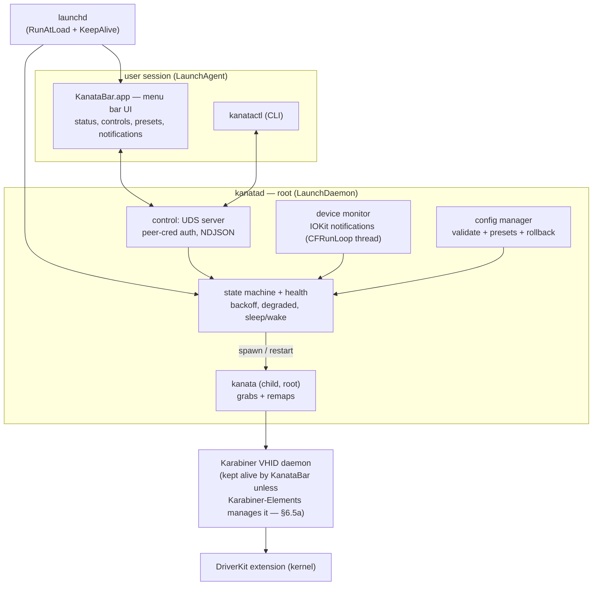

# KanataBar — macOS supervisor & menu-bar app for kanata

> **Version 2 build reference, written to be executed by Claude Code with minimal human input.**
> Name: **KanataBar** — follows the macOS menu-bar-app naming convention (MeetingBar, TomatoBar,
> Hidden Bar) while spelling out "kanata" for search. Renaming is a find-replace.
>
> Artifacts: repo `kanatabar` · daemon `kanatad` · CLI `kanatactl` · app `KanataBar.app`
> launchd labels `io.github.ibimal.kanatabar.daemon` / `.agent`

---

## 0. Automation contract (read first)

This spec is designed so Claude Code can build the project phase-by-phase with objective gates.

**Rules for the agent:**

1. Build phases **in order** (§19). A phase is done only when its `just gate-N` command exits 0.
2. Acceptance criteria are split into **[AUTO]** (machine-checkable, must pass in CI/sandbox) and
   **[HW]** (requires real hardware/root/human action — implement, then print a manual checklist
   and stop for the human).
3. Constraints marked **[HARD]** are non-negotiable design invariants.
4. Facts marked **[VERIFY]** must be checked against the installed kanata / Karabiner / macOS
   versions before code relies on them (`kanata --version`, `systemextensionsctl list`).
5. Every phase ends with: `just check` green (fmt + clippy + tests + deny), a git commit
   `phase-N: <summary>`, and an updated `docs/PROGRESS.md` (one line per phase: date, status,
   deviations from spec).
6. Never weaken a gate to make it pass. If a gate is wrong, record the proposed change in
   `docs/PROGRESS.md` and ask the human.
7. Any secret (e.g. a signing identity, if one is ever used) comes from the environment; never
   hardcode, never commit. If absent, the step becomes a no-op that prints instructions.

**Repository must contain from Phase 0:** `CLAUDE.md`, `justfile`,
`rust-toolchain.toml`, `deny.toml`, `.github/workflows/ci.yml`, `docs/SPEC.md` (this file),
`docs/PROGRESS.md`.

---

## 1. Goal & scope

Make kanata behave like a first-class macOS service:

1. **Daemon**: starts at boot, exactly one instance, survives crashes with bounded backoff.
2. **Device re-sync** — the core gap: kanata matches input devices once at startup and never
   re-scans; a hotplugged keyboard is invisible until kanata restarts. KanataBar restarts it
   automatically (debounced).
3. **Config management**: presets, validate-before-apply, last-known-good rollback.
4. **Menu bar app**: live status/layer, start/stop/pause, preset switching, notifications.
5. **CLI** at full parity (scripting, headless, diagnostics).
6. **First-run wizard** for driver + permissions + service install.
7. **Homebrew-first distribution** — free, un-notarized, `brew upgrade` is the updater; no
   in-app update mechanism (§12, §13).

Non-goals: Linux/Windows; reimplementing remapping; a config *editor* GUI (open in `$EDITOR`).

---

## 2. Facts about kanata on macOS (design inputs)

- **Not standalone [HARD]:** requires the **Karabiner-DriverKit-VirtualHIDDevice** system
  extension plus the **Karabiner-VirtualHIDDevice-Daemon** root process. kanata creates a
  virtual keyboard through it and grabs physical ones.
- **The VHID daemon is NOT kept alive by the driver pkg [HARD, verified 2026-07]:** the
  standalone Karabiner-DriverKit-VirtualHIDDevice pkg installs the daemon binary at
  `/Library/Application Support/org.pqrs/Karabiner-DriverKit-VirtualHIDDevice/Applications/Karabiner-VirtualHIDDevice-Daemon.app/Contents/MacOS/Karabiner-VirtualHIDDevice-Daemon`
  but registers **no LaunchDaemon** — pqrs-org documents that client apps must run it themselves
  (launchd with `ProcessType: Interactive` recommended; see their `SMAppServiceExample`). Only a
  full Karabiner-Elements install manages it. KanataBar therefore **manages the VHID daemon**
  (§6.5a, Phase 9) unless something else (Karabiner-Elements, a user LaunchDaemon such as the
  community `org.pqrs.karabiner-daemon`) already does.
- **Driver version is coupled to the kanata version [VERIFY per release]:** each kanata release
  pins a supported driver version (e.g. kanata v1.12.0 → driver **v6.2.0**, while the newest
  pqrs release may be ahead, e.g. v8.0.0). "Install the latest driver" can be wrong; the wizard
  and `doctor` must check the *kanata-supported* version, not merely presence.
- **Root required [HARD]:** kanata must run as root on macOS to grab HID devices.
- **Single instance [HARD]:** a second kanata fails with "device already open/in use". The
  supervisor guarantees exactly one child and kills orphans before spawning.
- **Device matching happens once at startup [HARD]:** live-reload does **not** re-apply
  device-related config; re-sync = full restart of the kanata process. **[VERIFY]** whether the
  installed kanata grabs hotplugged devices itself; if yes, the device monitor demotes to a
  safety net (restart only if a new keyboard isn't grabbed within N seconds).
- **Prefer name-based matching:** write `macos-dev-names-include` (names from `kanata --list`);
  device hashes are unstable for BLE/virtual devices.
- **TCP server:** `kanata --port <p>` emits NDJSON events (e.g. `{"LayerChange":{"new":"<layer>"}}`)
  and accepts commands. Use it for live layer display; it is **not** a supervision substitute.
  **[VERIFY]** exact message set against the installed version.
- **Panic escape:** `lctl+spc+esc` force-exits kanata. Treat that exit as an intentional stop
  (detect via exit timing/code), not a crash-loop trigger.
- **Permissions [HARD, verified on HW 2026-07-11, macOS 26.5.1 + kanata 1.12 via a full
  grant matrix]:** the driver's system extension must be activated **and approved**, and
  **`kanatad` needs BOTH Input Monitoring AND Accessibility**. TCC attributes the kanata
  child's device access to the **supervising daemon** (the launchd job is the responsible
  process): the kanata binary itself needs **no** grants, and its self-registered Input
  Monitoring entry is not consulted. Approval clicks cannot be automated — the wizard opens
  the right pane and verifies afterwards behaviorally.
- **TCC grants bind to kanatad's code identity [HARD, verified]:** updating **KanataBar**
  silently invalidates both grants even though the entries still show enabled — remove (−)
  and re-add (+) is the fix; updating **kanata does not affect them** (a UX win of the
  supervisor architecture vs. running kanata as its own daemon, where every `brew upgrade
  kanata` breaks the grant — jtroo/kanata#1743). Plain linker-signed ad-hoc binaries hold
  grants fine (verified; no re-signing needed). TCC.db is SIP-protected even from root, so
  the grant *database* cannot be read — but kanatad **can** read its **own** grant via the
  public per-process APIs (`IOHIDCheckAccess` for Input Monitoring, `AXIsProcessTrusted` for
  Accessibility), which the doctor now does (kanatad is the responsible process, so its own
  grant is the one that matters). Policy is conservative pending HW confirmation of the
  daemon-context read (docs/HW-TESTS.md): a definitive Input-Monitoring `Denied` fails the
  check, an indeterminate/untrusted read stays informational, and the runtime backstop
  remains behavioral — a denied kanata dies
  with "kanata needs macOS Input Monitoring permission" (v1.12; older releases:
  `privilege violation`, kanata#1037), which the supervisor classifies from the child's
  output into `Degraded{InputMonitoringDenied}` — an actionable message, never a futile
  crash loop. "exclusive access / already open" classifies as `Degraded{DeviceGrabConflict}`;
  a TCP `AddrInUse` panic as `Degraded{TcpPortConflict}`. [VERIFY] the exact strings per
  kanata release.

---

## 3. Architecture — Model B (self-supervising root daemon)

Two processes; a Unix-domain-socket control channel; launchd only keeps each process alive.
The daemon is the brain; the tray and CLI are thin clients of the same protocol.



**Why Model B [HARD]:** the daemon owns kanata as a child, so "restart on device change" is an
in-process kill+respawn — no XPC privileged helper, no cross-boundary `launchctl kickstart`, one
root binary with three modules.

### 3.1 Threading model [HARD]

- **tokio** runtime: socket server, supervision, state machine, timers, kanata-TCP client.
- **One dedicated OS thread owning a CFRunLoop**: IOKit device notifications and
  `IORegisterForSystemPower` sleep/wake callbacks are delivered here; bridge into tokio via an
  `mpsc` channel. Never drive a CFRunLoop from inside tokio; never block the CFRunLoop thread.
- **Tray**: the macOS event loop (tao/winit) must own the **main thread**; socket I/O on a
  background tokio runtime, UI updates marshaled to main.

### 3.2 Filesystem layout at runtime [HARD]

| Path | Owner/mode | Purpose |
|---|---|---|
| `/usr/local/bin/kanatad`, `/usr/local/bin/kanatactl` | root, 0755 | binaries |
| `/Applications/KanataBar.app` | admin | tray app |
| `/Library/LaunchDaemons/io.github.ibimal.kanatabar.daemon.plist` | root, 0644 | daemon job |
| `~/Library/LaunchAgents/io.github.ibimal.kanatabar.agent.plist` | user | tray job |
| `/var/run/kanatabar.sock` | root:staff, 0660 | control socket (recreated each start) |
| `/Library/Application Support/KanataBar/config.toml` | root, 0644 | supervisor config |
| `/Library/Application Support/KanataBar/state.json` | root, 0600 | active preset, child PID, last-known-good pointers |
| `/Library/Application Support/KanataBar/backups/` | root | last-known-good `.kbd` copies |
| `/Library/Logs/KanataBar/` | root, dir 0755 | rotated JSON logs |

---

## 4. Tech stack

- **Rust stable**, edition 2021, MSRV pinned in `rust-toolchain.toml`; workspace of 4 crates (§5).
- Crates: `tokio` (full), `serde`/`serde_json`, `toml`, `clap` (derive), `tracing` +
  `tracing-subscriber` + `tracing-appender`, `thiserror` (libs) / `anyhow` (bins),
  `nix` (signals, socket peer creds), `core-foundation` + `io-kit-sys` (or `objc2` +
  `objc2-io-kit`) for FFI, `tray-icon` + `muda` + `tao` for the tray, `objc2-user-notifications`
  or `osascript` fallback for notifications (upgrade path in §18 notes).
- **Targets:** `aarch64-apple-darwin` + `x86_64-apple-darwin`, shipped as a **universal binary**
  via `lipo`. Minimum macOS **12** (Monterey) unless a dependency forces 13. **[VERIFY]**
- Supply chain: `cargo-deny` (licenses, advisories, bans) + committed `Cargo.lock`.

---

## 5. Repository layout

```
kanatabar/
├── CLAUDE.md                    # agent contract
├── justfile                     # all build/test/gate commands
├── rust-toolchain.toml
├── deny.toml
├── Cargo.toml                   # workspace
├── crates/
│   ├── kanatabar-core/          # PURE logic: state machine, IPC types, config model, backoff
│   ├── kanatad/                 # daemon bin: supervisor/, device/, control/, health/, install/
│   ├── kanatactl/               # CLI bin (socket client)
│   └── kanatabar-tray/          # menu bar app bin
├── resources/
│   ├── launchd/                 # both plists (job templates)
│   ├── icons/                   # tray status icons (template images for dark/light)
│   └── mock-kanata/             # test double (§17)
├── packaging/
│   ├── build-universal.sh       # cargo build both targets + lipo
│   └── build-pkg.sh             # componentize (ad-hoc signed, §12)
├── .github/workflows/ci.yml     # fmt, clippy -D warnings, test, deny (macos runner)
└── docs/  (SPEC.md = this file, PROGRESS.md, SECURITY.md)
```

**[HARD]** `kanatabar-core` has **no I/O and no FFI** — every state transition, backoff
computation, IPC (de)serialization, and config validation rule is unit-testable on any OS.

---

## 6. Daemon (`kanatad`)

### 6.1 Child lifecycle

- Spawn via `tokio::process::Command`: `kanata --cfg <preset> --port <tcp> --nodelay` + preset
  `extra_args`. Capture stdout/stderr → structured log (`source=kanata`).
- **Preflight before every spawn [HARD]:** (a) driver check (§6.5); (b) orphan sweep — if
  `state.json` has a PID, verify liveness + that the process name matches kanata, SIGTERM →
  3s → SIGKILL; also scan for stray kanata processes we own; (c) config `--check` (§6.4).
- Classify exit: `Requested` (we signaled), `PanicEscape` (user), `Crash{code/signal}`.
- **Graceful daemon shutdown [HARD]:** on SIGTERM/SIGINT: stop accepting IPC, SIGTERM child,
  wait ≤3s, SIGKILL, persist `state.json`, flush logs, exit 0. launchd must see clean exits.

### 6.2 State machine (in `kanatabar-core`, table-driven)

| State | Enters on | Leaves to |
|---|---|---|
| `Stopped` | init / user stop | `Starting` |
| `Starting` | start, reload, device/config change | `Running`, `Backoff`, `Degraded` |
| `Running` | spawn OK + health OK | `Starting` (reload), `Backoff` (crash), `Stopped`, `Paused` |
| `Backoff` | crash / failed start | `Starting` (timer) or `Degraded` (budget spent) |
| `Degraded` | retry budget exhausted, driver missing, config broken | `Starting` (user action) |
| `Paused` | user toggle | `Starting` |

- **Backoff:** exponential 1s→2s→4s→8s… cap 30s; budget e.g. 5 consecutive failures →
  `Degraded`; a 60s healthy window resets the budget. Constants in config, defaults in core.
- **Debounce [HARD]:** device/config events coalesce over 500ms (configurable) into one restart.
- Every transition: log + push `Event{StateChanged}` to subscribers + persist to `state.json`.

### 6.3 Device monitor

- `IOServiceAddMatchingNotification` for keyboard-class HID add + termination notifications for
  removal, on the CFRunLoop thread → `DeviceChanged{added/removed, name}` into core.
- Observes registry **presence only** — reads no key events, needs no Input Monitoring. [HARD]
- Ignore the Karabiner **virtual** device and kanata's own outputs (filter by name/vendor) to
  avoid restart feedback loops. [HARD]

### 6.4 Config & presets

- Supervisor TOML (§3.2 path), root-owned; presets name → `.kbd` path (+ optional kanata bin,
  extra args, autostart). Users edit preset `.kbd` files wherever they like; the supervisor
  config itself is modified only via IPC (`SetPresetList`) or sudo.
- **Validate before apply [HARD]:** `kanata --cfg <path> --check` must pass or the switch is
  refused with the parse errors returned over IPC. A bad config can never take the keyboard down.
- **Path safety [HARD]** (root daemon reading user-supplied paths): canonicalize; must be a
  regular file (no symlink traversal outside allowed roots); must be owned by root **or** the
  requesting connection's uid; must not be group/world-writable. Reject otherwise with
  `ErrorKind::PathRejected`.
- **Last-known-good:** on every successful apply, copy the `.kbd` into `backups/` and update the
  pointer in `state.json`; `Degraded{ConfigBroken}` offers one-command rollback. Also ship a
  built-in **safe minimal config** (transparent passthrough) as a final fallback.
- Watch active `.kbd` via file events (`notify` crate) → debounce → validate → restart on change.

### 6.5 Health

- **Driver preflight [HARD]:** parse `systemextensionsctl list` for the Karabiner DriverKit
  extension in `activated enabled` state, and check the VHID daemon is running. Failure →
  `Degraded{DriverNotActivated | VhidDaemonDown}` with an actionable message — never a crash loop.
- **Liveness:** child alive + TCP connect within timeout after spawn; TCP client then relays
  layer events; TCP loss alone triggers reconnect attempts, not restart (unless PID also gone).
- **Sleep/wake [HARD]:** `IORegisterForSystemPower`; on wake, re-verify driver + child + grab;
  restart if unhealthy. Common real-world failure a naive supervisor misses.
- **kanata version:** log `kanata --version` at start; warn if below a known-good floor.

### 6.5a VHID daemon management (Phase 9)

The driver pkg does not keep `Karabiner-VirtualHIDDevice-Daemon` running (§2) — without help,
every reboot leaves kanata dead with `asio` connect errors. Rules:

- **Detect before managing [HARD]:** if the daemon is already supervised by someone else —
  Karabiner-Elements is installed, or any launchd job for it exists (`launchctl print system`
  labels containing `karabiner`, e.g. the community `org.pqrs.karabiner-daemon`) — KanataBar
  only health-checks it (`Degraded{VhidDaemonDown}` as today). **Never run a second instance.**
- Otherwise `kanatactl install` writes and bootstraps
  `/Library/LaunchDaemons/io.github.ibimal.kanatabar.vhidd.plist`: `RunAtLoad` + `KeepAlive`,
  `ProcessType Interactive` (pqrs recommendation), program = the §2 daemon binary path.
  `uninstall` boots it out and removes it (ours only — never touch pqrs/user plists).
- `doctor` checks: daemon binary present → exactly **one** daemon process running → managed by
  (ours | Karabiner-Elements | user plist | unmanaged-warn). The wizard gains a step that
  offers to install our plist when unmanaged.
- Preflight order stays driver-extension-first: an inactive extension makes the daemon useless.

### 6.6 Logging & performance budget

- `tracing` JSON to `/Library/Logs/KanataBar/kanatad.log`, size/day rotation, keep N files;
  in-memory ring buffer (e.g. 2000 lines) serves `GetLogs`/`--follow`.
- **Never log keystrokes or key events. Never log `.kbd` contents.** State + errors only. [HARD]
- **Performance [HARD]:** zero polling anywhere (notifications + events only); idle CPU ≈ 0%;
  daemon RSS target < 20 MB, tray < 40 MB; restart latency after debounce < 1s to spawn.

---

## 7. Control IPC protocol

### 7.1 Transport & security [HARD]

- UDS at `/var/run/kanatabar.sock`, mode 0660 `root:staff`, unlinked+recreated on start.
- **Framing:** NDJSON (one JSON object per line, UTF-8). Max line 64 KiB; oversize → close.
- **Peer auth:** on accept, read peer credentials (`LOCAL_PEERCRED` → `xucred`); allow uid 0 and
  the **current console user** (owner of `/dev/console`); reject others and log. All payloads
  remain untrusted input: serde-validate, bound sizes, never exec strings from the socket.
- **Versioning:** every response/event carries `"v": 1`. Client sends `Hello{min_v,max_v}` first;
  daemon replies `HelloAck{v}` or `Error{Incompatible}`. Additive changes keep `v`; breaking
  changes bump it.

### 7.2 Messages (types live in `kanatabar-core`, exhaustively unit-tested round-trip)

Requests: `Hello`, `GetStatus`, `Subscribe`, `Start`, `Stop`, `Restart`, `Pause`, `Resume`,
`SwitchPreset{name}`, `ListPresets`, `ValidateConfig{path}`, `ApplyConfig{path}`,
`SetPresetList{presets}`, `GetLogs{lines}`, `FollowLogs`, `GetDevices`, `SetAutostart{enabled}`,
`Doctor`.

Responses/events: `HelloAck`, `Ack{id}`, `Error{id, kind, message}`,
`Status{state, active_preset, active_layer, kanata_pid, kanata_version, driver_ok, last_error, uptime_s, daemon_version}`,
`Event{ StateChanged | LayerChanged | DeviceChanged | Crash | DriverIssue | ConfigApplied }`,
`LogLine`, `DoctorReport{checks: [{name, ok, detail, fix_hint}]}`.

`ErrorKind` enum (stable, machine-usable): `Incompatible`, `InvalidRequest`, `PathRejected`,
`ConfigInvalid`, `DriverNotActivated`, `VhidDaemonDown`, `AlreadyRunning`, `NotRunning`,
`Internal`.

Example status push:

```json
{"v":1,"id":null,"type":"Status","state":"Running","active_preset":"main","active_layer":"base","kanata_pid":4123,"kanata_version":"1.8.1","driver_ok":true,"last_error":null,"uptime_s":8021,"daemon_version":"0.3.0"}
```

### 7.3 Supervisor config example

```toml
schema = 1

[defaults]
kanata_bin  = ""              # empty => /usr/local/bin/kanata, then /opt/homebrew/bin/kanata
                              # (fixed allowlist; never $PATH from the root daemon — §14)
tcp_port    = 5829
extra_args  = ["--nodelay"]
debounce_ms = 500
backoff     = { base_ms = 1000, cap_ms = 30000, budget = 5, reset_after_s = 60 }

[presets.main]
config    = "/Users/alice/.config/kanata/main.kbd"
autostart = true

[presets.gaming]
config = "/Users/alice/.config/kanata/gaming.kbd"
```

---

## 8. Menu bar app (`kanatabar-tray`)

- `LSUIElement = true` (no Dock icon); LaunchAgent-managed; single instance (bail if socket
  already served by another tray via a per-user lock file).
- Connects, `Hello` + `Subscribe`, renders state; exponential reconnect when the daemon bounces.
- **Menu:** state line + active layer (disabled items) · Start/Stop/Restart · Pause/Resume ·
  Presets submenu (checkmark) · Edit Config (opens in default editor) · Validate Config ·
  Devices (window, see below) · View Logs · Setup Assistant… (demoted once setup is
  complete, §11.1) · Health Check… (the doctor window, §11.3) ·
  Launch at Login (agent toggle) · Quit KanataBar (tray only; daemon keeps running — say so).
  **No "Check for Updates" item** — updates are `brew upgrade` (§13), matching AeroSpace/
  kanata-tray precedent for un-notarized OSS menu-bar apps.
- **Devices window** (Phase 12; docs/design/phase12-ui-layer.md): the Devices item opens a
  window listing every visible input device with its matched/grabbed state, updating **in
  place** on `DeviceChanged` events — the tray's subscription already delivers them, so no
  polling and no re-open needed after hotplug. Read-only (no actions). Until Phase 12 lands,
  the v0.1.x interim stays: a one-line notification summary.
- **Icons:** template images (auto dark/light): running / paused / degraded (badge) / disconnected.
- **Notifications:** crash, entered `Degraded` (with fix hint), recovery.
  If UNUserNotificationCenter is unavailable un-bundled during dev, use `osascript` fallback
  behind a trait so the implementation can swap. [VERIFY on target macOS]

---

## 9. CLI (`kanatactl`)

Full parity with the tray; `--json` on every read command for scripting.

```
kanatactl status [--json]           kanatactl preset list|switch <name>
kanatactl start|stop|restart        kanatactl config validate|apply <path>
kanatactl pause|resume              kanatactl devices
kanatactl logs [-n N] [--follow]    kanatactl doctor [--json]
sudo kanatactl install|uninstall [--agent-only|--daemon-only]
```

- `doctor` runs the full preflight: binary versions, driver state, VHID daemon, permissions,
  daemon reachable, socket perms, active preset validity — printed as a ✅/❌ checklist with fix
  hints; `--json` output doubles as a bug-report bundle. **This is also the manual-QA oracle.**
- Exit codes: 0 ok · 1 operational error · 2 usage · 3 cannot connect · 4 degraded.

---

## 10. Installation & launchd

Primary mechanism: **pkg-installed LaunchDaemon + LaunchAgent with `launchctl` bootstrap** —
the same pattern Karabiner-Elements itself uses; fully scriptable, no ObjC required.
(`SMAppService` registration is an optional later enhancement — §19 Phase 11 — giving native
Login-Items visibility; not on the critical path.)

Daemon plist (template; agent analogous in `gui/<uid>` domain):

```xml
<?xml version="1.0" encoding="UTF-8"?>
<!DOCTYPE plist PUBLIC "-//Apple//DTD PLIST 1.0//EN" "http://www.apple.com/DTDs/PropertyList-1.0.dtd">
<plist version="1.0"><dict>
  <key>Label</key><string>io.github.ibimal.kanatabar.daemon</string>
  <key>ProgramArguments</key><array>
    <string>/usr/local/bin/kanatad</string><string>run</string>
  </array>
  <key>RunAtLoad</key><true/>
  <key>KeepAlive</key><true/>
  <key>ProcessType</key><string>Interactive</string>
  <key>AssociatedBundleIdentifiers</key><string>io.github.ibimal.kanatabar</string>
  <key>StandardOutPath</key><string>/Library/Logs/KanataBar/kanatad.out.log</string>
  <key>StandardErrorPath</key><string>/Library/Logs/KanataBar/kanatad.err.log</string>
</dict></plist>
```

- `kanatactl install` (root): copy binaries, write plists from templates, create dirs with the
  §3.2 ownership/modes, `launchctl bootstrap system …`, bootstrap agent into `gui/<uid>`.
- `kanatactl uninstall`: `bootout` both, remove binaries/plists/socket/state/logs/app — leave
  **nothing** behind (checklist-tested).
- `AssociatedBundleIdentifiers` makes macOS 13+ attribute the background items to KanataBar in
  System Settings → Login Items. [VERIFY key behavior on target macOS]
- The Karabiner **driver/extension** is not ours to manage; the **VHID daemon** is managed per
  §6.5a (install our LaunchDaemon for it only when nothing else supervises it).

---

## 11. Setup wizard & doctor (one check engine, two intents)

Checks are implemented **once** (names in `kanatabar-core::doctor`, execution in the daemon;
the Phase 8 [AUTO] gate pins the JSON schema) and rendered by two deliberately different
products:

- **Wizard** — ordered, stateful, goal-driven, self-dismissing. Goal: fresh machine → running
  kanata. Shows only the *next* unmet step and hides everything else. The first-run experience.
- **Doctor** — unordered, stateless, exhaustive, always available. Goal: "why is it broken
  *now*?" on an already-set-up machine. Shows *every* check and hides nothing; never auto-opens.
  `kanatactl doctor` (§9) stays report-only: diagnose and hint, never mutate (brew/flutter
  `doctor` precedent).

[HARD] Anti-overlap rule: the doctor never implements onboarding flows — a setup-class failure
deep-links into the wizard at the failing step (invert the wizard's step→check `verifies`
mapping). The wizard never renders the full checklist — its terminal step hands off to doctor.

Precedents: Karabiner-Elements (first-launch window, live-polling checkmarks); LuLu & OBS
(linear first-run wizard, re-runnable from a menu); Docker Desktop (flat "Troubleshoot" panel
with per-item actions + one-click diagnostics bundle).

### 11.1 Check classes

- **Setup-class** (the wizard owns the fix): driver present · driver version · karabiner
  driver (activated) · vhid daemon managed · input monitoring · daemon (installed).
- **Runtime-class** (doctor-only): kanata binary · vhid daemon (running) · control socket ·
  active config · config file · supervisor.

The classification lives beside the check names in `kanatabar-core::doctor` (single source,
like `ALL_CHECKS`). **Setup is complete** ⇔ every setup-class check passes.

### 11.2 Wizard (window; every step re-checkable)

Steps (unchanged):

1. Detect/install **Karabiner-DriverKit-VirtualHIDDevice** pkg — link to the version the
   installed kanata supports (§2 version coupling), not blindly the latest; detect version.
2. Activate the extension — the wizard **runs** the documented request itself
   (`/Applications/.Karabiner-VirtualHIDDevice-Manager.app/Contents/MacOS/Karabiner-VirtualHIDDevice-Manager activate`,
   no sudo, in the user's session — verified against the pqrs README 2026-07; single source
   `kanatabar_core::vhidd::MANAGER_BINARY`) — then sends the user to Privacy & Security to
   **approve** (openable, not clickable, by us); verify via `systemextensionsctl list`.
   **[VERIFY on each new Karabiner release]**
3. Ensure the VHID daemon is supervised (§6.5a): offer to install our vhidd LaunchDaemon when
   nothing manages it; skip when Karabiner-Elements or a user plist already does.
4. Input Monitoring grant if required → open pane, verify.
5. Install daemon (admin prompt) → 6. Install agent → 7. Run `doctor`, show green checklist.

Window behavior (Phase 12):

- **Auto-opens** when the tray starts and setup is incomplete (§11.1); never auto-opens once
  setup is complete. Stays reachable from the menu as "Setup Assistant…" for re-runs
  (OBS pattern).
- One window: all steps as a vertical checklist; the first unsatisfied step expanded with its
  instruction and action buttons — "Do it for me" (runs the step's `run` argv, e.g. driver
  activation) and "Open System Settings" (the step's pane).
- **Live re-check**: while the window is open, re-run doctor on a short poll (~2 s) so steps
  flip green as the user approves things in System Settings — no "re-check" button
  (Karabiner-Elements pattern).
- A supervisor degradation overrides a green checklist (HW Run 9): `DegradedReason` maps back
  onto its check, and the wizard trusts the daemon over the static checks.
- [HARD] Steps needing sudo (`kanatactl install`) are shown as copyable commands; the tray
  never elevates and never runs them itself.

### 11.3 Doctor window ("Health Check…", Phase 12)

- Flat list of **all** checks with ✅/❌, detail, and fix hint visible — replaces the temp-file
  report the tray opens today.
- Per-check fix affordances, three tiers:
  1. Safe, idempotent, in-process → a real button (activate driver, re-validate config, open
     the relevant Settings pane).
  2. Setup-class failure → "Open Setup Assistant at this step" (delegation; §11 [HARD] rule).
  3. Needs sudo → copyable command only (§11.2 rule applies).
- **Copy report** button: `doctor --json` to the clipboard — the §9 bug-report bundle in one
  click (Docker diagnostics-bundle pattern).
- Degraded-state notifications/banners (§8) are unchanged; the window is pull, not push.

Until Phase 12 lands, the tray keeps the v0.1.x interim behavior: "Setup Wizard…" runs doctor
and opens the pane for the first failing step; "Run Doctor" notifies a summary and opens the
text report.

---

## 12. Packaging & signing

**Decision (2026-07, final): no paid Apple Developer Program — ever, unless the project's
circumstances change.** Notarization ($99/yr) and in-app auto-update are **out of scope**, not
deferred phases. Precedent: AeroSpace ships un-notarized via a Homebrew tap with no update UI;
yabai/skhd and kanata itself ship unsigned binaries. The **Mac App Store is impossible** for
this app class (root LaunchDaemon, `/usr/local` binaries, no sandbox) — a non-goal, and
unrelated to notarization anyway.

- Universal binaries (`build-universal.sh`: build both targets, `lipo -create`).
- **Ad-hoc sign** (`codesign -s -`) app + binaries — required on Apple silicon anyway, and keeps
  TCC grants stable across a given release artifact.
- Artifacts: `KanataBar-<ver>.pkg` (payload: app → `/Applications`, binaries →
  `/usr/local/bin`; postinstall: dirs, plists, bootstrap daemon) **and** a plain `tar.gz` of the
  binaries for `kanatactl install`. GitHub Releases + Homebrew tap are the install paths.
- README/cask caveat documents the Gatekeeper reality: quarantined un-notarized apps need
  System Settings → Privacy & Security → *Open Anyway* on macOS 15+ (the right-click-Open
  bypass is gone); `brew`-fetched artifacts can be installed with `--no-quarantine`.
- If Developer ID signing is ever revisited (e.g. sponsorship), it slots in as an alternate
  signing step in `packaging/`; nothing in the build assumes it exists.

---

## 13. Distribution & updates

The standard OSS approach, nothing more:

- **GitHub Releases** carry the pkg + tarball + SHA-256 checksums; release notes from
  git-cliff/CHANGELOG.
- **Homebrew tap** (`ibimal/homebrew-tap`): cask installing the pkg — primary install path;
  the release workflow bumps it.
- **`brew upgrade` is the only update mechanism.** No update checker, no updater UI, no
  appcast, no self-install [HARD: the root daemon never self-replaces]. The README says so.
  Auto-installing unsigned pkgs would be a security hole, and an un-notarized app nagging about
  downloads maximizes Gatekeeper friction — AeroSpace made the same call.

---

## 14. Security model (summarize in docs/SECURITY.md)

Threats & mitigations:

| Threat | Mitigation |
|---|---|
| Non-console local user drives root daemon via socket | peer-cred allowlist (uid 0 + console user), 0660 socket |
| Malicious IPC payloads | serde strict types, size caps, `ErrorKind` (no panics), fuzz the decoder |
| Symlink/TOCTOU via `ApplyConfig` path | canonicalize + regular-file + ownership + not-world-writable checks (§6.4), open once, validate the opened file |
| Command injection | never shell-interpolate; `Command` with arg arrays only |
| Keystroke exposure | daemon never subscribes to key events; logging bans (§6.6); no telemetry |
| Supply chain | `cargo-deny` advisories/bans, `Cargo.lock` committed, CI audit |
| Update tampering | no in-app updater (§13); installs/updates go through Homebrew (cask SHA-256) or manual GitHub Releases download with published checksums |
| Unsafe FFI bugs | all `unsafe` confined to `kanatad/src/ffi/`, `deny(unsafe_op_in_unsafe_fn)`, documented invariants, wrapper types returning safe APIs |

---

## 15. Rust engineering standards [HARD]

- `cargo fmt` clean; `cargo clippy --workspace --all-targets -- -D warnings` clean.
- No `unwrap`/`expect` outside tests and provably-infallible cases (comment why).
- Errors: `thiserror` enums in libs, `anyhow` + context at bin edges; user-facing messages
  actionable ("Karabiner driver not activated — run Setup Wizard"), never raw Debug dumps.
- `unsafe` only in the FFI module; each block has a `// SAFETY:` comment.
- Public items documented; `#![warn(missing_docs)]` on `kanatabar-core`.
- Tests colocated + `tests/` integration dir; table-driven state-machine tests; serde round-trip
  tests for every IPC type; property tests (proptest) for backoff and debounce logic.
- CI (GitHub Actions, macOS runner): fmt → clippy → test → deny, required on PR/main.

---

## 16. Edge-case checklist (each becomes a test or a doctor check)

- [ ] Orphaned kanata from previous daemon → swept before spawn
- [ ] Driver not activated / VHID daemon down → `Degraded`, actionable, no loop
- [ ] Fresh reboot with no Karabiner-Elements → VHID daemon up via our plist (§6.5a), kanata runs
- [ ] Karabiner-Elements installed alongside → we do NOT start a second VHID daemon
- [ ] Driver version unsupported by installed kanata → doctor ❌ with the supported version named
- [ ] Input Monitoring not granted (or invalidated by a kanata update) → `Degraded{InputMonitoringDenied}` with the remove-and-re-add hint, no crash loop
- [ ] Keyboard held by another remapper → `Degraded{DeviceGrabConflict}`, names the likely culprit
- [ ] Invalid config on switch → refused, current keeps running
- [ ] Active config edited to something broken → old process keeps running, notify, rollback offer
- [ ] Crash loop → backoff → `Degraded` → "start last-known-good / safe config" offered
- [ ] Hotplug storm (dock) → exactly one restart per settle window
- [ ] Bluetooth keyboard reconnect cycles → debounced, no thrash
- [ ] Sleep/wake grab loss → detected and recovered on wake
- [ ] Panic escape → `Stopped`, not `Backoff`
- [ ] Daemon killed −9 → launchd revives; socket recreated; tray reconnects; no orphan child
- [ ] Fast user switching → only console user's clients accepted
- [ ] kanata binary missing/incompatible → clear `Degraded`, no spin
- [ ] Uninstall leaves nothing (verified file list)
- [ ] Update replaces both binaries; daemon comes back on new version

---

## 17. Testing strategy

- **`mock-kanata`** (small Rust bin in `resources/mock-kanata/`): flag-driven behaviors —
  run-forever, exit-after N ms with code, crash-on-signal, serve fake TCP layer events, accept
  `--check` (pass/fail by flag). Lets Phases 1–3 run **entirely without root, devices, or real
  kanata** — this is what makes automated development possible.
- Unit: everything in `kanatabar-core` (state machine tables, backoff/debounce properties,
  IPC round-trips, config validation rules).
- Integration: daemon + mock-kanata + real UDS in a temp dir (socket path injectable via env for
  tests [HARD]); CLI driven end-to-end against it.
- Fuzz (cargo-fuzz, optional gate): NDJSON decoder.
- **[HW] matrix** (human, guided by `docs/HW-TESTS.md` the agent generates): USB/BT hotplug,
  dock, sleep/wake, driver-off, reboot persistence, panic escape, update-in-place.

---

## 18. Implementation notes & known frictions

- Peer creds on macOS: `getsockopt(LOCAL_PEERCRED)` → `struct xucred` (via `nix` or direct FFI).
- Console user: `stat("/dev/console").uid` (simple, adequate) — note SCDynamicStore alternative.
- `tray-icon` on macOS requires the event loop on main thread and an app bundle for some
  features (notifications, proper focus); during dev, run unbundled with osascript
  notifications, bundle in Phase 9.
- IOKit matching dict: `IOServiceMatching("IOHIDDevice")` + usage-page/usage filter for
  keyboards; filter out Karabiner virtual devices by name/vendor. Keep all of it behind
  `device::Monitor` trait so tests inject fake events.
- If `objc2` ecosystems lag, prefer raw `core-foundation`/`io-kit-sys` — smaller surface.
- launchd domain note: daemon in `system`, agent in `gui/<uid>`; `launchctl print` is the
  debugging tool; document in HW-TESTS.

---

## 19. Phases & gates

Each phase: implement → `just check` → `just gate-N` → commit → update PROGRESS.md.
**[AUTO]** gates run headless; **[HW]** gates print a checklist and pause for the human.

| N | Deliverable | Gate (`just gate-N`) |
|---|---|---|
| 0 | Scaffold: workspace, CLAUDE.md, justfile, CI, toolchain, deny, core skeleton, mock-kanata | [AUTO] build+test+lint green; `mock-kanata --help` works |
| 1 | Supervisor core (foreground `kanatad run`): spawn/monitor mock, full state machine, backoff, logging | [AUTO] integration: crash→backoff→degraded; healthy-window reset; graceful SIGTERM; transitions logged |
| 2 | UDS server + `kanatactl` (status/start/stop/restart/subscribe), peer auth, protocol v1 | [AUTO] CLI round-trips vs daemon+mock in temp dir; wrong-uid peer rejected (simulated); serde round-trip 100% of types |
| 3 | Config/presets: TOML, validate-before-apply, switch, last-known-good, safe config, file watch | [AUTO] invalid config refused while old keeps running; rollback works; path-safety cases rejected |
| 4 | Device monitor (IOKit + CFRunLoop thread + debounce) behind `Monitor` trait | [AUTO] fake-event debounce tests; [HW] real hotplug → single restart |
| 5 | Health: driver preflight, sleep/wake, orphan sweep, kanata TCP layer relay | [AUTO] preflight parser tests on captured `systemextensionsctl` outputs; [HW] driver-off → Degraded; wake recovery |
| 6 | `install`/`uninstall`, plists, real-root run | [HW] reboot persistence; kill −9 revival; clean uninstall audit |
| 7 | Tray app: menu, icons, subscribe/reconnect, notifications, agent | [AUTO] UI-less client logic tests; [HW] visual/menu checklist |
| 8 | Wizard + `doctor` (shared checks) | [AUTO] doctor JSON schema stable; [HW] clean-machine onboarding via prompts only |
| 9 | Dependency hardening: VHID-daemon management (§6.5a — detect/install/health-check our vhidd LaunchDaemon), driver-version-vs-kanata `doctor` check, wizard step | [AUTO] detection/plist logic + doctor checks against fixtures; [HW] reboot → kanata alive with no Karabiner-Elements installed |
| 10 | Release (§12/§13): bundle, universal build, ad-hoc sign, pkg + tarball, GitHub Release + Homebrew tap, release workflow | [AUTO] packaging scripts run cleanly in CI; [HW] brew-install on a clean Mac → wizard → working remap; `brew upgrade` replaces both binaries and the daemon comes back |
| 11 | *(Optional)* SMAppService registration path | design doc first, then implement |
| 12 | Wizard, doctor & devices windows (§11.2–§11.3, §8). UI-layer design doc first (docs/design/phase12-ui-layer.md — evaluate a minimal native window vs `egui`/`winit` vs webview against §4 constraints), then the devices window (smallest: read-only list, proves the shell), then the doctor window (static list + buttons, replaces the temp-file report), then the live-rechecking wizard window with first-run auto-open | [AUTO] check-classification + step↔check mapping-inversion + window view-model tests; doctor JSON schema still stable. [HW] clean-machine onboarding driven by the wizard window alone; doctor-window visual checklist incl. delegation into the wizard; hotplug flips the devices window in place |

---

## 22. Open-source checklist (pre-announce)

- [x] LICENSE (Apache-2.0)
- [x] README: what/why (the hotplug + boot + recovery story), install (brew), screenshot of menu,
      doctor output sample, comparison note vs kanata-tray (macOS-native lifecycle focus)
- [x] docs/SECURITY.md (§14) + a disclosure contact (GitHub private vulnerability reporting)
- [x] CONTRIBUTING.md (just check, phase/spec structure), issue templates (attach `doctor --json`)
- [x] CHANGELOG + tagged v0.1.0 once Phases 0–8 pass
- [ ] Announce in kanata's GitHub Discussions once stable

---

## 23. References

- kanata: https://github.com/jtroo/kanata · config: https://jtroo.github.io/config.html
- Karabiner-DriverKit-VirtualHIDDevice (driver + VHID daemon) — install & activation docs
- kanata-tray (prior art, cross-platform tray): https://github.com/rszyma/kanata-tray
- Apple: Daemons & Services guide; notarytool docs; launchd.plist(5)

**[VERIFY] before shipping:** kanata hotplug behavior on the installed version; exact TCP message
set; Karabiner activation commands; `AssociatedBundleIdentifiers` behavior; minimum macOS floor
imposed by chosen crates.
